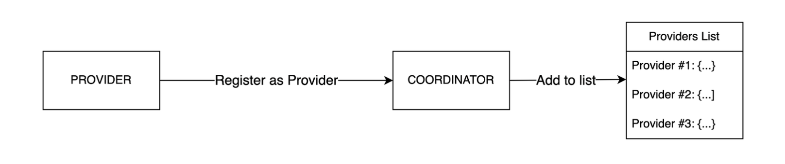
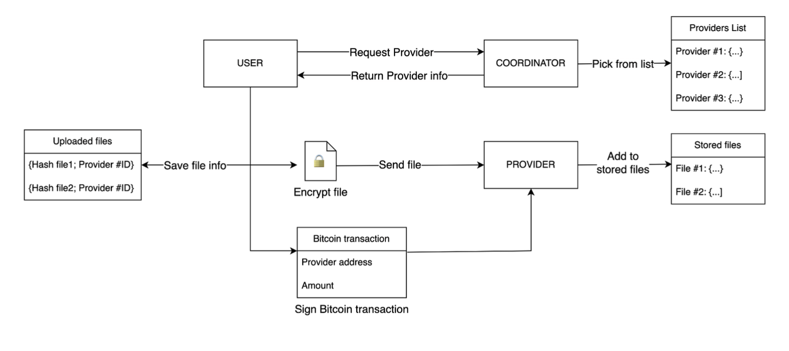
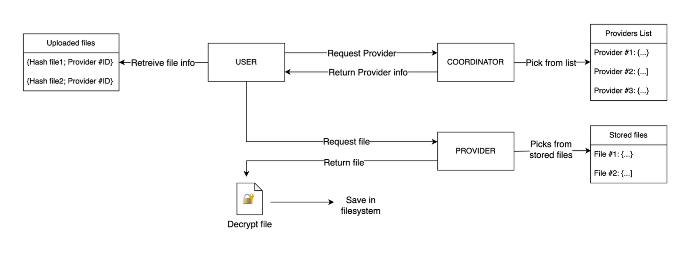

# Peer-to-peer file storage with machine-to-machine Bitcoin payments

## Contents
1. [Objective](#objective)
2. [Description](#description)
3. [Specifications](#specifications)
4. [Implementation](#implementation)
5. [Future developments](#future-developments)
6. [Resources](#resources)

## Objective

The purpose of the project is to implement a distributed file storage system in which the service is offered by the users themselves and not by a central entity. To ensure security, the system relies on cryptographic evidence and automatic micro-transactions made on the Bitcoin network. Users who use the service pay according to the space they actually use, and users who offer the service have the economic incentive from the fees they earn.

## Description

The project is implemented using the Rust programming language and several libraries that will be mentioned in the following analysis of the specifications. The JSON format is also used to store certain information. The choice to use Rust derives mainly from the advantages it offers in terms of memory safety and performance; in addition, the Rust Bitcoin Development Kit library is one of the best for building Bitcoin wallets. The Tokio library is also used for concurrent programming.

## Specifications

The project is organized into two modules, "client" and "coordinator."  
The software in the client module can be used in two modes, depending on whether the user wants to act as a "User," i.e., the one who uses the storage service, or as a "Provider," i.e., the one who offers his or her own storage space. The "Coordinator" is a third actor whose only task is to keep track of all users registered as Providers and to connect a User who is requesting the service with a Provider who is offering the service.

Once the client module software is started, the user can decide whether to use it in "User" or "Provider" mode. In any case, the first time the program is started on a device, it generates:

1.  A cryptographic key that will be used to encrypt and decrypt the uploaded files.
2.  A Bitcoin wallet and its private key.

This information is saved in an encrypted `secrets.json` file. The user is only asked to create a password to access this file.

If the "Provider" mode is chosen, the client opens a TCP connection with the Coordinator, which saves the information about that Provider in a `providers.json` file.

If "User" mode is chosen, the commands that the user can execute are shown.

How the Upload and Download features work is explained below.

### Upload
The client opens a TCP connection with the Coordinator.

The user enters the file path, then the file size is calculated and communicated to the Coordinator. From the registered Providers, the Coordinator selects one whose storage space is sufficient and returns the Provider information to the client. The client encrypts the file using the encryption key in `secrets.json`, calculates its SHA256 hash, and sends this information to the Provider, which saves it in a local file. In this way, a proof of integrity of the file (the hash) is maintained and the user's privacy is guaranteed because the Provider saves the encrypted file and has no way of accessing the decryption key.  

Simultaneously, the client saves to a local JSON file the information about the newly uploaded file, including its hash and the ID of the Provider on which it is stored. Note that the client's saving of the file's hash locally is necessary to ensure that the file's integrity is verified during download.

Finally, the client creates a Bitcoin transaction by specifying the address of the recipient (the Provider) and the amount calculated based on the size of the file, so the user pays proportionally to the space he or she requests.

### Download
The user is asked for the name of the file he wants to download and the directory in which he wants to store it. The client, after checking that the file name matches one of those in the local JSON file, opens a TCP connection with the Coordinator, sending the ID of the Provider that stored the file (this information is in the client's local JSON file). Upon receiving the Provider information, the client connects with the Provider and sends it the hash of the file it wants to download. After receiving the contents of the encrypted file from the Provider, the client recalculates its hash and compares it with the one it had saved locally, verifying that they match. If the check is successful, the client decrypts the file using the decryption key in `secrets.json`, saves it to the directory specified by the user, and removes the information about that file from its local JSON file.

## Implementation

 ### Secrets management
The storage part of the private information is handled with the SecureStore library, which is responsible for creating a `secrets.json` file containing a list of values encrypted with a randomly generated key and allowing access at runtime. The `secrets.json` encryption key generated by SecureStore is stored within a `secrets.key` file covered by a password set by the user. When the program is started, the values of the cryptographic algorithm key and the private key of the Bitcoin wallet are added to the `secrets.json`.

### File encryption algorithm
The cryptographic algorithm used is XChaCha20-Poly1305 (reference in the Resources section) and is part of the AEAD family of symmetric key algorithms. Whenever an encryption/decryption operation is to be performed on a file, the AEAD key is extracted from `secrets.json` using the key contained in `secrets.key` and a random nonce is also generated in order to apply the cryptographic algorithm.

### Bitcoin wallet
The Bitcoin wallet part is handled with the Bitcoin Development Kit (BDK) library, which abstracts some of the operations necessary for creating a wallet. A private key is first generated and then the public key is derived using the ECDSA elliptic curve algorithm. The hash of the public key is computed, obtaining a Bitcoin address that looks like an alphanumeric string. Clearly, in order to test the operation conveniently and quickly, Bitcoin testnet addresses are used. As far as sending a transaction is concerned, the wallet creates a PSBT (Partially Signed Bitcoin Transaction) that has the Provider's Bitcoin address as the recipient and an amount that is calculated proportionally to the size of the file to be transferred. The PSBT is subsequently signed with the sender's private key and finally broadcasted. 

All functions related to the Bitcoin wallet are contained in the `bdkwallet.rs` file and are invoked within the client's `main.rs`.

### JSON files
The Coordinator maintains a list of Providers that have registered in the `providers.json` file. Specifically, the information saved is: a randomly generated identification code (ID), the IP address, and the Bitcoin address of the Provider. 

The Client in User mode keeps in the `my_files.json` file a list of information about the files it has uploaded and which are therefore available for download. Specifically, for each file are saved: the name, the SHA256 hash of the encrypted file, and the identification code (ID) of the Provider to which the file was transferred.

The Client in Provider mode maintains in the `stored_files.json` file a list of the files in storage, and in particular the hash and the contents of the encrypted file.

The JSON objects stored in the files enunciated above are serialized and deserialized using the SerdeJSON library.

## Future developments

In the context of real use of the software, there are some aspects that can be developed further, especially regarding the reliability of the service.

Indeed, it would be necessary to prevent (or disincentivize) that a Provider may not be reachable when a user wants to make a download. To do this, one could implement the idea of a penalty transaction: at the time an upload is made and the Provider receives the file, he pre-signs a 2-of-2 transaction, i.e., a transaction that requires two signatures (in this case, the Provider's signature and the User's signature) in order to be carried out. If at the time of downloading the Provider is not reachable or the file does not match the requested one, the User will unlock the 2-of-2 transaction by signing it and receive the funds at the expense of the Provider.

An additional layer of security in order to protect users could be to give the ability to replicate the file to different Providers to decrease the risk of file compromise. At the user experience level, this functionality could be proposed as the choice of a degree of security (low, medium, high) that results in an increasing number of replications as well as cost.

## Resources

Bitcoin Development Kit: https://github.com/bitcoindevkit  
SecureStore: https://docs.rs/securestore/latest/securestore/
XChaCha20-Poly1305: https://en.wikipedia.org/wiki/ChaCha20-Poly1305
AEAD Encryption: https://en.wikipedia.org/wiki/Authenticated_encryption 
Tokio Framework: https://docs.rs/tokio/latest/tokio/  
SerdeJSON: https://docs.rs/serde_json/latest/serde_json/
